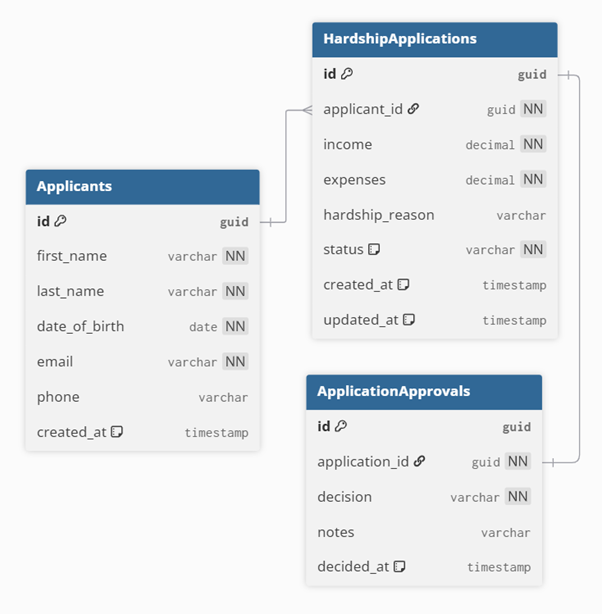

# Hardship Application System

## Overview
A full-stack web application for managing financial hardship applications. The system allows users to submit, view, update, and manage hardship applications, with support for applicant management and application approvals.

## Tech Stack
- **Backend:** .NET 9, ASP.NET Core Web API
- **Frontend:** React, TypeScript, Ant Design
- **Database:** SQLite, Entity Framework Core
- **Testing:** xUnit, Moq, Microsoft.AspNetCore.Mvc.Testing

## Prerequisites
- [.NET 9 SDK](https://dotnet.microsoft.com/download)
- [Node.js 18+](https://nodejs.org/)

## Getting Started

### Backend
First-time setup: this project uses SQLite and does not auto-apply migrations on startup, so initialize the database before running the API.

If `dotnet ef` is not available on your machine, install it first:
```bash
dotnet tool install --global dotnet-ef
```

```bash
cd HardshipApp.Api
dotnet restore
dotnet ef database update --project ../HardshipApp.DataAccess
dotnet run
```
API: `http://localhost:5000`  
Swagger: `http://localhost:5000/swagger/index.html`

### Frontend
Start the backend first, then run the frontend:

```bash
cd hardship-client
npm install
npm run dev
```
Frontend: `http://localhost:5173`

## Architecture

The request flow is:
1. Request reaches a **Controller** in `HardshipApp.Api`
2. The controller delegates to the **Service** layer
3. The service applies business logic and calls a **Repository**
4. The repository queries SQLite via **EF Core**
5. Responses are returned to the client

Key design points:
- **Multi-layered architecture** separates concerns across API, Service, Repository, DataAccess, and Models layers
- **Global Exception Handler** converts exceptions into consistent JSON error responses
- **DTOs and Mappers** ensure type safety across the stack
- **Repository pattern** abstracts data access and improves testability

## Business Rules

### Applications
- Creating a hardship application automatically creates the associated applicant
- Application status defaults to `Pending` on creation
- Approving or rejecting an application updates the application status
- Email must be unique per applicant

### Approvals
- An approval decision can be `Pending`, `UnderReview`, `Approved`, or `Declined`
- Creating an approval updates the application status to match the decision

## API Endpoints

### Hardship Applications
| Method | Endpoint | Description |
|--------|----------|-------------|
| GET | /api/hardshipapplications | Get all applications |
| GET | /api/hardshipapplications/{id} | Get application by ID |
| POST | /api/hardshipapplications | Create new application |
| PUT | /api/hardshipapplications/{id} | Update application |
| DELETE | /api/hardshipapplications/{id} | Delete application |
| POST | /api/hardshipapplications/{id}/approvals | Create an approval decision |
| GET | /api/hardshipapplications/{id}/approvals | Get approval by application ID |

### Applicants
| Method | Endpoint | Description |
|--------|----------|-------------|
| GET | /api/applicants | Get all applicants |
| GET | /api/applicants/{id} | Get applicant by ID |
| POST | /api/applicants | Create new applicant |
| PUT | /api/applicants/{id} | Update applicant |

## Example Requests

### Create Application
```json
POST /api/hardshipapplications
Content-Type: application/json

{
  "firstName": "John",
  "lastName": "Doe",
  "dateOfBirth": "1990-01-01",
  "email": "john.doe@example.com",
  "phone": "0400000000",
  "income": 50000,
  "expenses": 30000,
  "hardshipReason": "Lost job"
}
```

### Update Application
```json
PUT /api/hardshipapplications/{id}
Content-Type: application/json

{
  "income": 60000,
  "expenses": 40000,
  "hardshipReason": "Medical expenses",
  "status": 1
}
```

### Approve Application
```json
POST /api/hardshipapplications/{id}/approvals
Content-Type: application/json

{
  "decision": 2,
  "notes": "Approved after review"
}
```

## Application Status
| Value | Status |
|-------|--------|
| 0 | Pending |
| 1 | UnderReview |
| 2 | Approved |
| 3 | Declined |

## Running Tests

### All Tests
```bash
dotnet test
```

### Integration Tests Only
```bash
cd HardshipApp.IntegrationTests
dotnet test
```

### Unit Tests Only
```bash
cd HardshipApp.UnitTests
dotnet test
```

## Test Strategy

**Unit Tests** cover:
- `HardshipApplicationService`
- `ApplicantService`
- `ApplicationApprovalService`

**Integration Tests** cover:
- HardshipApplication API endpoints
- Applicant API endpoints
- Approval API endpoints

Integration tests use `WebApplicationFactory<Program>` with an in-memory database for isolation.

## Database Schema



### Relationships
- One **Applicant** can have many **HardshipApplications**
- One **HardshipApplication** can have one **ApplicationApproval**

## Project Structure
```text
hardship-application-system/
|-- HardshipApp.Api              # Controllers, Program.cs, Middleware
|-- HardshipApp.Common           # Shared models and exceptions
|-- HardshipApp.DataAccess       # AppDbContext and EF Core migrations
|-- HardshipApp.IntegrationTests # Integration tests
|-- HardshipApp.Models           # Entity models and enums
|-- HardshipApp.Repository       # Repository interfaces and implementations
|-- HardshipApp.Service          # Services, DTOs, and mappers
|-- HardshipApp.UnitTests        # Unit tests
`-- hardship-client              # React/TypeScript frontend
```

## Troubleshooting

**CORS error in browser**  
Make sure the backend is running on `http://localhost:5000` and the frontend on `http://localhost:5173`.

**Database not found**  
Run `dotnet ef database update --project ../HardshipApp.DataAccess` from the `HardshipApp.Api` directory.

**Frontend cannot connect to API**  
Check `hardship-client/src/api/hardshipApi.ts` and verify `baseURL` matches the backend port.
